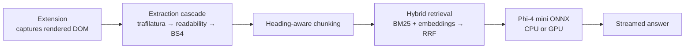

# Browser Assistant (Phi-4)

A local, private RAG assistant that answers questions about the web page you're
reading. A Chrome/Edge extension captures the page, and a local **Phi-4 mini**
ONNX model generates the answer. Inference runs entirely on your machine, on
**CPU or GPU**.

This is a Phi-4 based rebuild of [Browser-Assistant](https://github.com/ShamikRana/Browser-Assistant),
which used Phi-3.5-mini.

## How it works



1. **Capture** - the extension reads the *rendered* DOM of the active tab. This
   is what makes JavaScript-heavy, logged-in and paywalled pages work; a plain
   server-side fetch only sees the initial HTML. If injection isn't allowed
   (e.g. `chrome://` pages), the backend fetches the URL instead.
2. **Extract** - three extractors run in cascade until one returns usable text,
   so unusual layouts still parse. Output is markdown, which preserves headings.
3. **Chunk** - text is split along heading boundaries, and each chunk keeps its
   section path (e.g. `Install > Windows`) as retrieval context.
4. **Retrieve** - a dense embedding search and a BM25 lexical search run
   independently and are merged with Reciprocal Rank Fusion. Embeddings catch
   paraphrases; BM25 reliably catches names, numbers and rare terms.
5. **Generate** - the retrieved context is passed to Phi-4 mini, and tokens are
   streamed back to the popup as they're produced.

Only page retrieval and the one-time model download need the network. Questions,
page content and answers never leave your machine.

## Highlights

| Area | Approach |
|---|---|
| Page parsing | 3-stage extraction cascade over the **rendered DOM**, not raw HTML |
| Retrieval | Hybrid **BM25 + dense** with Reciprocal Rank Fusion |
| Summaries | Broad questions sample the whole page instead of the top-k nearest chunks |
| Short pages | Skip retrieval entirely and pass the full text |
| Speed | Per-page index cache, token streaming, model warm-up, greedy decoding |
| Hardware | One codebase; `auto` picks GPU when available, else CPU |
| Startup | Scheduled Task (Windows) or systemd user service (Linux) |

## Project structure

```
.
├── requirements.txt
├── backend/
│   ├── serve.py                # Entrypoint (used by scripts and auto-start)
│   ├── server.py               # FastAPI app: /health, /query, /query/stream
│   ├── pipeline.py             # extract → retrieve → generate
│   ├── extraction.py           # Extraction cascade
│   ├── chunking.py             # Heading-aware chunking
│   ├── retrieval.py            # Hybrid retrieval + index cache
│   ├── phi4_runtime.py         # Phi-4 ONNX wrapper (CPU/GPU, streaming)
│   ├── config.py               # Central configuration
│   ├── download_model.py       # Model downloader
│   ├── run_server.bat / .sh    # Manual start
│   ├── register_startup.ps1    # Windows auto-start
│   ├── unregister_startup.ps1
│   └── install_service.sh      # Linux auto-start (systemd user service)
└── extension/
    ├── manifest.json
    ├── background.js           # Backend status badge
    ├── popup.html / .css / .js
    └── icons/
```

## Setup

### 1. Create a virtual environment

```powershell
git clone <this-repo-url>
cd Browser-Assistant-Phi4

python -m venv venv
.\venv\Scripts\Activate.ps1      # Windows
# source venv/bin/activate       # Linux/Mac
```

### 2. Install dependencies

```powershell
pip install -r requirements.txt
```

For NVIDIA GPU inference, swap the ONNX runtime package:

```powershell
pip uninstall -y onnxruntime-genai
pip install onnxruntime-genai-cuda "onnxruntime-gpu[cuda,cudnn]"
```

To also run *embeddings* on the GPU, install a CUDA-enabled PyTorch build:

```powershell
pip install --force-reinstall torch --index-url https://download.pytorch.org/whl/cu128
```

If CUDA-enabled PyTorch isn't present, Phi-4 still uses its ONNX CUDA provider
while embeddings fall back to CPU automatically.

### 3. Download the models

```powershell
cd backend
python download_model.py --device cpu   # or: gpu, both
```

This fetches Phi-4 mini instruct ONNX into `backend/models/phi4/` and the
`gte-small` embedding model into `backend/models/embedding/`. Already-downloaded
models are skipped.

### 4. Start the backend

```powershell
# Windows
run_server.bat            # auto-detect device; or: run_server.bat gpu

# Linux/Mac
./run_server.sh           # or: ./run_server.sh gpu
```

The start scripts download any missing models before launching. To run the
server directly:

```powershell
python serve.py --device auto
```

### 5. Load the extension

The backend must be running first.

1. Go to `chrome://extensions` (or `edge://extensions`).
2. Enable **Developer mode** (toggle, top-right).
3. Click **Load unpacked** and select the `extension/` folder.
4. Pin the extension icon to the toolbar.
5. Open any page, click the icon, type a question, and press **Ask**
   (or `Ctrl+Enter`). Use the quick chips for summaries and key points.
6. After editing anything in `extension/`, click **Reload** on the extensions page.

> Loaded unpacked, the browser shows a "Developer mode extensions" warning
> banner - expected and harmless.

The toolbar badge shows backend status: no badge = ready, `…` = model loading,
`!` = backend unreachable.

## Start the backend automatically

The backend can't be launched by the extension itself (extensions can't spawn
processes), so it's registered with the operating system to start at login -
by which time it's loaded and warmed up before you open the browser.

### Windows

Open **PowerShell as Administrator** before registering the task. If Windows
reports that the script is not digitally signed, unblock it once from the
backend directory:

```powershell
cd backend
Unblock-File .\register_startup.ps1
```

Then register the task:

```powershell
.\register_startup.ps1 -StartNow          # auto-detect device
.\register_startup.ps1 -Device gpu        # force GPU
```

An elevated PowerShell is required because Task Scheduler may otherwise return
`Access is denied`. `Unblock-File` removes the download security mark so the
script can run under the normal `RemoteSigned` execution policy.

This registers a hidden Scheduled Task (`BrowserAssistantPhi4`) that runs
`pythonw.exe serve.py` - no console window, no prompts - with automatic restart
on failure. Logs go to `backend/logs/server.log`. To remove it:

```powershell
.\unregister_startup.ps1
```

### Linux

```bash
cd backend
./install_service.sh          # or: ./install_service.sh gpu
./install_service.sh --uninstall
```

Installs a systemd **user** service with `Restart=on-failure`. Run
`sudo loginctl enable-linger $USER` to keep it running without an active session.

## API

| Endpoint | Purpose |
|---|---|
| `GET /health` | Status, resolved device, whether the model is loaded |
| `POST /query` | Full answer in one JSON response |
| `POST /query/stream` | Server-sent events: `meta`, `token`, `done`, `error` |

**Request**

```json
{
  "url": "https://example.com/article",
  "question": "Summarize the main claim in one sentence.",
  "html": "<optional rendered DOM from the extension>"
}
```

**Response**

```json
{ "answer": "...", "title": "Example article", "chunks_used": 5, "elapsed": 3.4 }
```

Omit `html` and the backend fetches the URL server-side.

## Configuration

All settings are environment variables read by `backend/config.py`.

| Variable | Default | Purpose |
|---|---|---|
| `DEVICE` | `auto` | `auto`, `cpu` or `gpu` |
| `HOST` / `PORT` | `127.0.0.1` / `5000` | Bind address |
| `TOP_K` | `5` | Chunks retrieved per question |
| `CHUNK_SIZE` / `CHUNK_OVERLAP` | `900` / `150` | Chunking granularity |
| `MAX_CONTEXT_CHARS` | `6000` | Context budget; lower is faster |
| `MAX_NEW_TOKENS` | `320` | Answer length cap |
| `FULL_CONTEXT_THRESHOLD` | `4000` | Pages shorter than this skip retrieval |
| `INDEX_CACHE_SIZE` | `8` | Pages kept indexed in memory |

## CPU vs GPU

| | CPU | GPU (CUDA) |
|---|---|---|
| Package | `onnxruntime-genai` | `onnxruntime-genai-cuda` + `onnxruntime-gpu[cuda,cudnn]` |
| Model variant | `cpu_and_mobile/cpu-int4-rtn-block-32-acc-level-4` | `gpu/gpu-int4-rtn-block-32` |
| Embeddings | CPU | CUDA when CUDA-enabled PyTorch is installed, else CPU |

`DEVICE=auto` selects GPU when its model files are present. If the GPU build
fails to load at runtime, the server logs a warning and falls back to CPU rather
than failing to start. Install only one `onnxruntime-genai*` package at a time.

## Troubleshooting

- **"Phi-4 model not found"** - run `python download_model.py --device <cpu|gpu>`.
- **Badge shows `!`** - the backend isn't running; start it, or check
  `backend/logs/server.log` if you use the auto-start task.
- **CUDA errors** - confirm `nvidia-smi` works and the `*-cuda` packages are
  installed. The server falls back to CPU automatically.
- **Empty or poor answers on a page** - the page may block script injection;
  the backend then fetches the URL, which can't see content rendered by
  JavaScript or behind a login.
- **Answers are slow on CPU** - lower `MAX_NEW_TOKENS` and `MAX_CONTEXT_CHARS`.
  Follow-up questions on the same page are much faster thanks to the index cache.

## License

See [LICENSE](LICENSE) for details.
